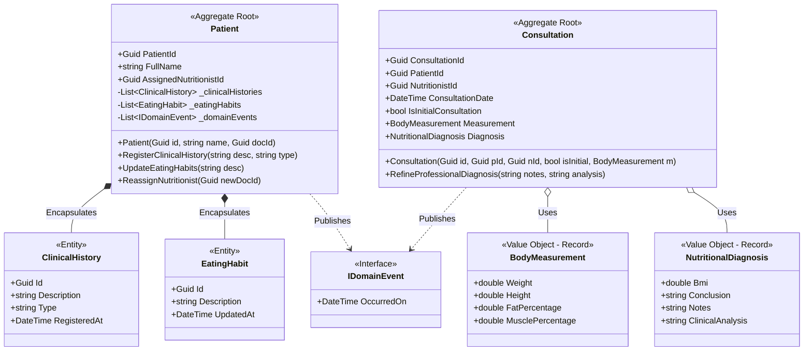

# Microservice: ms-patients-consul-core
**Course:** Diplomado en Microservicios - Final Project  
**Layer:** Domain Layer Implementation (Domain-Driven Design)

This repository contains the pure Domain Layer implementation for the `ms-patients-consul-core` microservice, strictly following tactical Domain-Driven Design (DDD) patterns and Clean/Hexagonal Architecture boundaries using **C# (.NET 8)**.

## Class Diagram (Domain Model)

## Architectural & Tactical Design Decisions

1. **Rich Domain Model vs. Anemic Model**: Entities do not just act as simple data holders with public getters and setters. All internal state modifications are strictly encapsulated. Business logic rules (such as computing the initial BMI and automatic nutritional classification in `Consultation`) happen autonomously inside the Domain.
2. **Encapsulation & Aggregate Boundaries**: Internal lists (`_clinicalHistories`, `_eatingHabits`, `_domainEvents`) are marked as `private readonly` and exposed to the outside exclusively as `IReadOnlyCollection`. This blocks external layers from directly invoking operations like `.Add()` or `.Clear()`, enforcing the usage of valid domain behaviors.
3. **Value Objects**: Physical components (`BodyMeasurement` and `NutritionalDiagnosis`) are designed using C# structural records to guarantee native immutability and value-object equality semantics. They incorporate a Fail-Fast mechanism inside their constructor block to prevent objects from being instantiated in an invalid state.
4. **Decoupling via Domain Events**: Changes within aggregate states produce highly explicit asynchronous records (`NewPatientRegisteredEvent`, `InitialConsultationRegisteredEvent`) to stream events safely across other bounded contexts.
